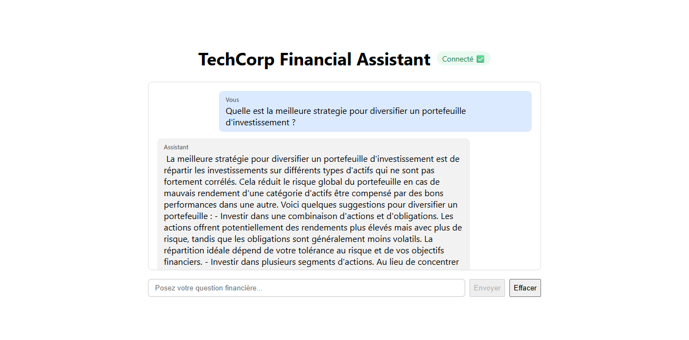

# DEV WEB — TechCorp Financial Assistant

Interface de chat pour interagir avec le modèle Phi-3.5-Financial déployé par
l'équipe INFRA via Ollama. Architecture : **API Express** (proxy de streaming
vers Ollama) + **front Angular** (servi par nginx), chacun dans son propre
conteneur Docker.

## Lancement (1 commande)

⚠️ **Étape obligatoire avant le tout premier lancement** (aucune valeur par
défaut n'est codée en dur, par bonne pratique de sécurité) :

```bash
cp .env.example .env
```

### Stack complète (recommandé) — depuis la racine du repo

Le `docker-compose.yml` racine inclut celui-ci (`include:`) et lance aussi le
serveur Ollama de l'INFRA :

```bash
docker compose up --build
```

- Front : http://localhost:4200 — Back : http://localhost:3000 — Ollama : http://localhost:11434

Sur le réseau Docker du projet racine, le back joint Ollama via son nom de
service (`OLLAMA_URL=http://ollama:11434`, valeur déjà présente dans `.env`
une fois copié depuis `.env.example`).

### Ce dossier seul (sans le service Ollama de l'INFRA)

Prérequis : un serveur Ollama joignable (en local ou sur le réseau) — voir
[mock-llm.md](./mock-llm.md) pour tester sans dépendre de l'INFRA.

```bash
docker compose up --build
```

En standalone, éditez `.env` pour pointer vers votre serveur (ex.
`http://host.docker.internal:11434` pour un Ollama/mock lancé sur l'hôte, ou
l'IP fournie par l'INFRA) — sinon le conteneur `back` ne démarrera pas
(`OLLAMA_URL` non défini).

## Lancement en développement (sans Docker)

Dans deux terminaux, depuis `rendu/devweb/` :

```bash
# terminal 1 - back
cd server
npm install
cp .env.example .env   # ajuster OLLAMA_URL si besoin
npm run dev             # http://localhost:3000

# terminal 2 - front
cd client
npm install
npm start                # http://localhost:4200, proxy /api -> :3000 (proxy.conf.json)
```

## Architecture

```
rendu/devweb/
├── docker-compose.yml     # orchestre les 2 conteneurs (back + front)
├── .env.example           # OLLAMA_URL / OLLAMA_MODEL pour docker compose
├── .env                    # copie locale non versionnee de .env.example (a creer si absent)
├── mock-ollama.js          # faux serveur Ollama (dev/tests, port 11434)
├── mock-llm.md             # comment utiliser le mock (voir aussi "Notes techniques")
├── server/                 # API Express (conteneur "back", port 3000)
│   ├── Dockerfile
│   ├── .env.example         # config pour lancement local sans Docker
│   └── src/
│       ├── index.js
│       └── routes/
│           ├── chat.js      # POST /api/chat -> proxy streaming vers Ollama
│           └── health.js    # GET  /api/health -> statut de connexion Ollama
└── client/                  # App Angular (conteneur "front" nginx, port 4200)
    ├── Dockerfile
    ├── nginx.conf
    ├── proxy.conf.json       # dev only (`ng serve`)
    └── src/app/
        ├── chat/                       # ChatComponent (messages, saisie, historique)
        ├── services/chat.service.ts    # streaming fetch + parsing NDJSON
        ├── services/health.service.ts  # polling /api/health toutes les 5s
        └── models/message.model.ts
```

Le front (nginx, port 4200) et le back (Express, port 3000) sont deux conteneurs
indépendants : le navigateur appelle directement `http://localhost:3000/api/*`
depuis la page servie sur `http://localhost:4200` (CORS activé côté Express).

## Fonctionnalités

- Chat avec réponses en streaming token par token
- Historique de conversation affiché et persisté (`localStorage`), survit à un F5
- Badge de statut de connexion au serveur Ollama (connecté / déconnecté),
  rafraîchi toutes les 5 secondes
- Bouton pour effacer l'historique

## Variables d'environnement (back)

Aucune valeur par défaut n'est codée en dur dans `docker-compose.yml` (bonne
pratique sécurité) : `.env` doit exister (`cp .env.example .env`) avant le
premier lancement.

| Variable       | Valeur dans `.env.example` | Description                                   |
|----------------|-----------------------------|------------------------------------------------|
| `OLLAMA_URL`   | `http://ollama:11434`      | URL du serveur Ollama (nom de service Docker, valable quand lancé depuis la racine) |
| `OLLAMA_MODEL` | `phi3-financial`            | Nom du modèle créé par l'INFRA (`ollama create`) |
| `PORT`         | `3000`                      | Port d'écoute de l'API                         |

## Notes techniques

Testé de bout en bout avant chaque commit (health check, streaming, badge
connecté/déconnecté, persistance de l'historique) via un faux serveur Ollama
le temps que l'INFRA finalise son déploiement — voir [mock-llm.md](./mock-llm.md).

## Captures d'écran

⚠️ Captures réalisées avec le **mock Ollama** ([mock-llm.md](./mock-llm.md)),
en attendant le vrai serveur Phi-3.5-Financial de l'INFRA — d'où la réponse
générique de l'assistant ("Bonjour ! Je suis votre assistant financier.").

| Connecté + historique vide | Réponse en streaming |
|---|---|
|  |  |

| Historique persisté après reload | Historique effacé | Badge déconnecté |
|---|---|---|
|  |  |  |

## Captures avec le vrai modèle (données réelles)

Stack complète lancée depuis la racine du repo (`docker compose up --build`) :
front + back + le vrai serveur Ollama de l'INFRA avec le modèle Phi-3.5-Financial.

| Connecté au vrai serveur Ollama | Réponse réelle du modèle financier |
|---|---|
|  |  |
